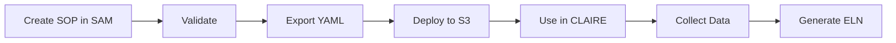

<!-- 
SPDX-FileCopyrightText: 2024-2025 Pathway Bio, Inc. <https://pwbio.ai>
SPDX-FileContributor: Kimberly Robasky
SPDX-License-Identifier: Apache-2.0
 -->

# SAM (by SYNDI) Environment Setup Guide

This guide walks you through setting up SAM (SOP Authoring to Models) on your local system, including configuration, dependencies, and starting the development server.

## What is SAM?

SAM is a web-based SOP authoring tool that:
- Creates structured, validated SOPs
- Ensures consistency across procedures
- Integrates with CLAIRE for data collection
- Supports regulatory compliance requirements

## Prerequisites

Before using SAM, you need to set up the development environment:

```bash
# 1. Set up local environment (first time only)
make setup-local ENV=dev
# This creates local S3 simulation directories and deploys existing configs
# Note: Config files must already exist in infra/.config/ (webapp, lambda)
# If missing, copy from infra/example-.config/ and customize (see 'Frontend Configuration Guide' below)

# 2. Install dependencies
cd frontend
npm install
cd ..

# 3. Start the development server
ENV=dev ORG=any make start-frontend
# Or for full stack (frontend + backend):
ENV=dev ORG=any make start-dev
```

The server will start on `http://localhost:3000`

For detailed configuration instructions, see:
- [Frontend Configuration Guide](../../shared/system-admin/frontend-configuration.md) - Explains config file structure and customization
- [General Configuration Guide](../../shared/system-admin/configuration.md) - Overall configuration management

### Default Development Credentials

When authentication is enabled, use these default development credentials:
- **Email**: `dev_user@local.dev`
- **Password**: `dev123`

## Quick Start (5 Minutes)

### Step 1: Access SAM

After starting the development server, open your web browser and navigate to:
- **Development**: `http://localhost:3000/sam`
- **Production**: Your organization's SAM URL

### Step 2: Create Your First SOP

1. Click **"New SOP"** button
2. Fill in the basic information:
   ```yaml
   ID: TEST_001
   Name: My First SOP
   Title: Test Protocol for Learning SAM
   Version: 0.1.0
   Author: Your Name
   Approver: Supervisor Name
   ```
3. Click **"Add Task Group"** to create a section
4. Click **"Add Task"** to create a tab
5. Click **"Add Field"** to add an input field
6. Click **"Validate"** to check your work
7. Click **"Export"** to save as YAML

Congratulations! You've created your first SOP.

## System Requirements

### Browser Requirements
- **Supported Browsers**: 
  - Chrome 90+ (Recommended)
  - Firefox 88+
  - Edge 90+
  - Safari 14+
- **JavaScript**: Must be enabled
- **Cookies**: Must be enabled for autosave
- **Screen Resolution**: 1280x720 minimum

### User Requirements
- Basic understanding of forms and data entry
- Familiarity with your laboratory procedures
- Access credentials (if required)

## Understanding the Workflow



## Key Concepts

### 1. SOPs (Standard Operating Procedures)
Structured documents that define step-by-step procedures for laboratory processes.

### 2. Task Groups
Top-level containers that organize related tasks. Rendered as cards in CLAIRE.

### 3. Tasks
Sections within task groups. Immediate children render as tabs in CLAIRE.

### 4. Fields
Individual data input elements (text, numbers, dates, files, etc.).

### 5. Validation
Automatic checking to ensure SOPs meet schema requirements.

### 6. Deployment
Publishing validated SOPs for use in CLAIRE data collection.

## First Full Example

Let's create a simple but complete SOP for a basic laboratory procedure:

### 1. Start with Metadata

```yaml
id: LAB_BASIC_001
name: "Basic Lab Procedure"
title: "Basic Laboratory Data Collection"
version: "1.0.0"
author: "Lab Tech"
approver: "Lab Manager"
date-published: "2024-01-20"
status: "draft"
```

### 2. Add a Task Group

```yaml
taskgroups:
  - id: main_procedure
    name: "Main Procedure"
    title: "Laboratory Procedure Steps"
    ordinal: 1
```

### 3. Add Tasks (Tabs)

```yaml
children:
  - id: setup_task
    '@type': Task
    name: "Setup"
    title: "Experiment Setup"
    ordinal: 1
```

### 4. Add Fields

```yaml
children:
  - id: date_field
    '@type': Field
    name: "Date"
    type: "string"
    format: "date"
    required: true
    
  - id: operator_field
    '@type': Field
    name: "Operator"
    type: "string"
    required: true
```

### 5. Complete SOP

Put it all together:

```yaml
'@context': https://schema.org
'@type': SoftwareApplication
id: LAB_BASIC_001
name: "Basic Lab Procedure"
title: "Basic Laboratory Data Collection"
version: "1.0.0"
author: "Lab Tech"
approver: "Lab Manager"
date-published: "2024-01-20"
status: "draft"
url: "https://example.com/sops/basic"
license: "MIT"
keywords: ["basic", "laboratory", "training"]
applicationCategory: "Laboratory Protocol"

taskgroups:
  - id: main_procedure
    name: "Main Procedure"
    title: "Laboratory Procedure Steps"
    ordinal: 1
    children:
      - id: setup_task
        '@type': Task
        name: "Setup"
        title: "Experiment Setup"
        ordinal: 1
        children:
          - id: date_field
            '@type': Field
            name: "Date"
            type: "string"
            format: "date"
            required: true
            
          - id: operator_field
            '@type': Field
            name: "Operator"
            type: "string"
            required: true
            
      - id: data_task
        '@type': Task
        name: "Data"
        title: "Data Collection"
        ordinal: 2
        children:
          - id: sample_id_field
            '@type': Field
            name: "Sample ID"
            type: "string"
            required: true
            
          - id: result_field
            '@type': Field
            name: "Result"
            type: "number"
            unit: "mg/mL"
            required: true
```

## Using the SAM Editor

### Main Interface Components

1. **Toolbar**
   - New SOP
   - Open/Load
   - Save/Export
   - Validate
   - Preview

2. **Form Builder**
   - Drag-and-drop interface
   - Property panels
   - Field configuration

3. **Preview Panel**
   - Real-time preview
   - Test interactions
   - Responsive view

4. **Debug Panel**
   - YAML/JSON view
   - Validation errors
   - Schema compliance

### Keyboard Shortcuts

| Shortcut | Action |
|----------|--------|
| Ctrl+S | Save/Autosave |
| Ctrl+N | New SOP |
| Ctrl+O | Open SOP |
| Ctrl+E | Export |
| Ctrl+V | Validate |
| Ctrl+P | Preview |
| Ctrl+Z | Undo |
| Ctrl+Y | Redo |

## Common Tasks

### Adding a Text Field

1. Click "Add Field" button
2. Set properties:
   - ID: `unique_field_id`
   - Name: "Display Name"
   - Type: "string"
   - Required: true/false

### Adding a Dropdown

1. Add field with type "string"
2. Add enum property:
   ```yaml
   enum: ["Option 1", "Option 2", "Option 3"]
   ```

### Adding a Number Field

1. Add field with type "number"
2. Set constraints:
   ```yaml
   min: 0
   max: 100
   unit: "mg"
   ```

### Adding a Date Field

1. Add field with type "string"
2. Set format:
   ```yaml
   format: "date"
   ```

### Creating a Table

1. Add Table object
2. Define columns:
   ```yaml
   columns:
     - name: "Sample ID"
       type: "string"
     - name: "Value"
       type: "number"
   ```

## Validation Basics

### What Gets Validated?

- Required fields present
- Field types correct
- IDs are unique
- Structure is valid
- References resolve

### Reading Validation Errors

```
Field: [taskgroups.0.children.0.type]
Error: Required property missing
Solution: Add '@type': Task to the object
```

### Quick Fixes

1. **Missing @type**: Add appropriate type annotation
2. **Duplicate IDs**: Make all IDs unique
3. **Type mismatch**: Check quotes on numbers
4. **Missing required**: Add all required fields

## Testing Your SOP

### In SAM

1. Use Preview mode
2. Enter test data
3. Check all tabs work
4. Verify validations trigger

### Local Testing

1. Export SOP as YAML
2. Save to `.local/s3/forms/sops/`
3. Start CLAIRE: `make start-claire`
4. Test form in CLAIRE

## Deployment Overview

### Development Workflow


```bash
# 0. Initial setup (first time only)
# Copy configs if they don't exist:
cp -r infra/example-.config/* infra/.config/
# Customize as needed - see Frontend Configuration Guide, link below
# Create local directories and deploy configs:
make setup-local ENV=dev

# 1. Start the servers if not already running
ENV=dev ORG=any make start-frontend  # SAM frontend
ENV=dev ORG=any make start-dev       # Full stack (frontend + backend)

# 2. Create SOP in SAM at http://localhost:3000/sam

# 3. Export as YAML

# 4. Deploy locally
cp my-sop.yaml .local/s3/forms/sops/

# 5. Test in CLAIRE at http://localhost:3000/claire
```
See [Frontend Configuration Guide](../../shared/system-admin/frontend-configuration.md) for help with customizing the configuration for your environment.


### Production Workflow

1. Create and validate in SAM
2. Test in development
3. Get approval
4. Deploy to production S3
5. Verify in production CLAIRE

## Best Practices for Beginners

### Start Simple
✅ Begin with a basic SOP
✅ Add complexity gradually
✅ Test each addition
✅ Save frequently

### Use Clear Names
✅ Descriptive IDs: `patient_id` not `field1`
✅ Clear labels: "Patient Identifier" not "ID"
✅ Helpful descriptions

### Validate Often
✅ After major changes
✅ Before exporting
✅ Before deployment

### Follow Examples
✅ Review [example SOPs](examples.md)
✅ Copy working patterns
✅ Adapt to your needs

## Common Beginner Mistakes

### Mistake 1: Complex First SOP
**Problem**: Trying to create everything at once
**Solution**: Start with 3-5 fields, then expand

### Mistake 2: Ignoring Validation
**Problem**: Skipping validation until the end
**Solution**: Validate after each section

### Mistake 3: Poor Naming
**Problem**: Generic IDs like `field1`, `field2`
**Solution**: Use descriptive, meaningful names

### Mistake 4: No Testing
**Problem**: Deploying without testing
**Solution**: Always test locally first

### Mistake 5: Missing Required Fields
**Problem**: Forgetting metadata fields
**Solution**: Use template or checklist

## Getting Help

### Self-Help Resources

1. **Documentation**
   - [Creating SOPs](creating-sops.md) - Detailed guide
   - [Examples](examples.md) - Working samples
   - [Schema Reference](schema-reference.md) - Complete reference
   - [Troubleshooting](troubleshooting.md) - Problem solving

2. **In-App Help**
   - Tooltips on hover
   - Context-sensitive help
   - Validation messages

### Community Support

- GitHub Issues
- Discussion forums
- User community

### Direct Support

- System administrator
- Technical support team
- Training sessions

## Next Steps

Now that you understand the basics:

1. **Practice**: Create a simple SOP following the example
2. **Explore**: Try different field types and configurations
3. **Learn**: Read the [detailed creation guide](creating-sops.md)
4. **Review**: Study the [examples](examples.md)
5. **Master**: Understand the [schema reference](schema-reference.md)

## Quick Reference Card

### Essential YAML Structure

```yaml
# Metadata (Required)
id: string
name: string
title: string
version: string
author: string
approver: string
date-published: YYYY-MM-DD

# Structure
taskgroups:
  - id: string
    children:
      - '@type': Task
        children:
          - '@type': Field
            type: string|number|boolean
```

### Field Types Quick Reference

| Type | Use For | Example |
|------|---------|---------|
| string | Text | Names, IDs |
| number | Numbers | Measurements |
| boolean | Yes/No | Checkboxes |
| date | Dates | Experiment date |
| file | Uploads | Documents |
| array | Lists | Multiple values |

### Validation Commands

```bash
# In SAM
Click "Validate" button

# Command line
make validate-sop FILE=my-sop.yaml

# Check deployment
ls .local/s3/forms/sops/
```

## FAQ

**Q: Can I edit deployed SOPs?**
A: Yes, but you should version them appropriately and redeploy.

**Q: How do I delete an SOP?**
A: Remove from S3 bucket or mark as "deprecated" status.

**Q: Can I copy an existing SOP?**
A: Yes, load it in SAM, modify, and save with new ID.

**Q: What's the maximum SOP size?**
A: Practically, keep under 100 fields for performance.

**Q: Can I use special characters in IDs?**
A: No, use only letters, numbers, and underscores.

## Congratulations!

You're ready to start creating SOPs in SAM. Remember:
- Start simple
- Validate often
- Test thoroughly
- Ask for help when needed

Happy SOP authoring!
