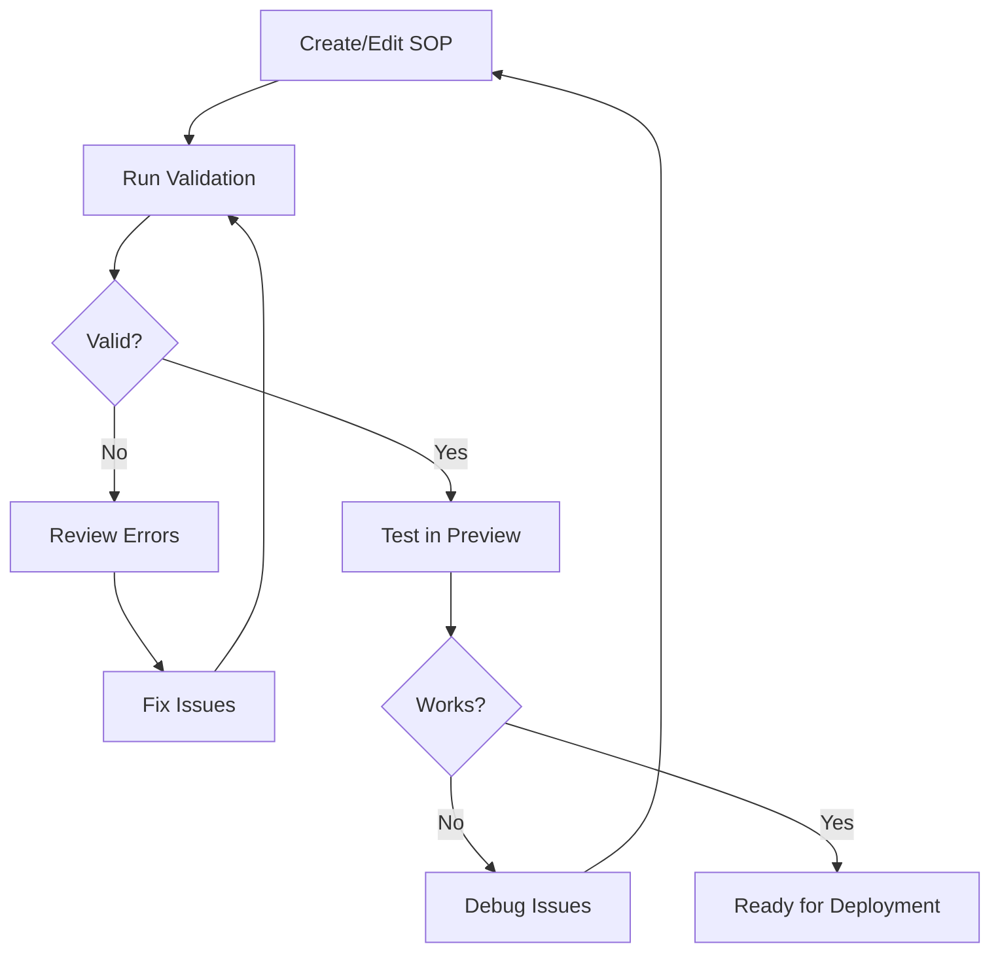

<!-- 
SPDX-FileCopyrightText: 2024-2025 Pathway Bio, Inc. <https://pwbio.ai>
SPDX-FileContributor: Kimberly Robasky
SPDX-License-Identifier: Apache-2.0
 -->

# SOP Validation Guide

## Overview

Validation ensures your SOP conforms to the SOPTemplateSchema and will render correctly in CLAIRE. This guide covers validation methods, common errors, and troubleshooting strategies.

## Why Validation Matters

- **Prevents Runtime Errors**: Catches issues before deployment
- **Ensures Data Integrity**: Validates field types and constraints  
- **Maintains Consistency**: Enforces standard structure across all SOPs
- **Improves User Experience**: Prevents broken forms in CLAIRE

## Validation Process

SAM uses **Zod** schema validation with strict mode enabled, meaning:
- All required fields must be present
- Field types must match declarations exactly
- No additional properties are allowed (`additionalProperties: false`)
- References must point to valid definitions

## Validation Methods

### Method 1: SAM Editor (Recommended)

The easiest way to validate is directly in the SAM editor:

1. Open your SOP in SAM
2. Click the **Validate** button in the toolbar
3. Review results in the validation panel
4. Fix any errors shown
5. Re-validate until all checks pass

**Visual Indicators:**
- ✅ Green checkmark = Valid
- ❌ Red X = Invalid
- ⚠️ Yellow warning = Non-critical issues

### Method 2: Command Line

For batch validation or CI/CD pipelines:

```bash
# Validate a single SOP
make validate-sop FILE=path/to/your-sop.yaml

# Validate all SOPs in a directory  
make validate-all-sops DIR=.local/s3/forms/sops

# Validate with verbose output
make validate-sop FILE=sop.yaml VERBOSE=true
```

### Method 3: Programmatic Validation

For custom scripts or automation:

```typescript
import { validateSOP } from '@shared/lib/sop-validator';

const result = await validateSOP(sopYamlContent);
if (result.valid) {
  console.log('✅ SOP is valid');
} else {
  console.error('❌ Validation errors:', result.errors);
}
```

## Understanding Validation Errors

### Error Structure

Validation errors follow this format:

```
Field: [path.to.field]
Error: [error description]
Expected: [what was expected]
Received: [what was provided]
```

### Common Validation Errors

#### 1. Missing Required Field

**Error:**
```
Field: [root].author
Error: Required field missing
Expected: string
Received: undefined
```

**Solution:** Add the missing field with appropriate value:
```yaml
author: "Dr. Jane Smith"
```

#### 2. Type Mismatch

**Error:**
```
Field: [taskgroups.0.ordinal]
Error: Invalid type
Expected: number
Received: string "1"
```

**Solution:** Use correct type (no quotes for numbers):
```yaml
ordinal: 1  # Not "1"
```

#### 3. Additional Properties

**Error:**
```
Field: [taskgroups.0]
Error: Unrecognized key(s) in object: 'customField'
```

**Solution:** Remove unknown properties or move to appropriate location:
```yaml
# Remove customField or place in children array
```

#### 4. Invalid Enum Value

**Error:**
```
Field: [root].status
Error: Invalid enum value
Expected: one of ["draft", "published", "deprecated"]
Received: "pending"
```

**Solution:** Use allowed value:
```yaml
status: "draft"  # or "published" or "deprecated"
```

#### 5. Invalid Date Format

**Error:**
```
Field: [root].date-published
Error: Invalid date format
Expected: YYYY-MM-DD
Received: "01/15/2024"
```

**Solution:** Use ISO date format:
```yaml
date-published: "2024-01-15"
```

#### 6. Pattern Mismatch

**Error:**
```
Field: [fields.project_id].value
Error: String does not match pattern
Pattern: ^PROJ-[0-9]{4}$
Received: "PROJECT-001"
```

**Solution:** Match required pattern:
```yaml
value: "PROJ-0001"
```

## Validation Rules

### Metadata Validation

| Field | Rules |
|-------|-------|
| `id` | Required, unique string |
| `name` | Required string, max 100 chars |
| `version` | Required, semantic version format |
| `author` | Required string |
| `date-published` | Required, ISO date format |
| `status` | Required enum: draft/published/deprecated |
| `url` | Required, valid URI format |
| `license` | Required string |

### Structure Validation

#### Task Groups
- Must have unique `id`
- Must contain `children` array
- Children must be valid Task objects
- `ordinal` must be positive integer if present

#### Tasks
- Must have unique `id`
- Must have `@type: Task`
- Must be child of TaskGroup
- Can contain Field children

#### Fields
- Must have unique `id`  
- Must have `type` property to render
- `required` must be boolean
- Validation rules must match type

### Type-Specific Validation

#### String Fields
```yaml
validation:
  minLength: 1
  maxLength: 255
  pattern: "regex"
  enum: ["option1", "option2"]
```

#### Number Fields
```yaml
validation:
  min: 0
  max: 100
  multipleOf: 0.5
  integer: true  # No decimals
```

#### Array Fields
```yaml
validation:
  minItems: 1
  maxItems: 10
  uniqueItems: true
```

#### File Fields
```yaml
file_config:
  accept: ".pdf,.jpg"  # File types
  maxSize: 10485760    # Bytes (10MB)
  multiple: false      # Single file only
```

## Advanced Validation

### Cross-Field Validation

Validate relationships between fields:

```yaml
cross_field_validations:
  - name: "date_range_check"
    fields: ["start_date", "end_date"]
    condition:
      type: "comparison"
      operator: "less_than_or_equal"
    error_message: "Start date must be before end date"
```

### Conditional Validation

Apply rules based on other fields:

```yaml
conditional_validation:
  - when:
      field: "sample_type"
      equals: "blood"
    then:
      field: "volume_ml"
      required: true
      min: 0.1
      max: 50
```

### Custom Validation Messages

Provide user-friendly error messages:

```yaml
validation:
  pattern: "^[A-Z]{3}-[0-9]{4}$"
  message: "Format must be: XXX-0000 (3 letters, hyphen, 4 digits)"
```

## Validation Best Practices

### Before Validation

1. **Review YAML syntax**: Use a YAML linter first
2. **Check structure**: Ensure proper indentation
3. **Verify IDs**: All IDs must be unique
4. **Complete metadata**: Fill all required fields

### During Validation

1. **Validate frequently**: Check after each major change
2. **Read errors carefully**: Error messages contain solutions
3. **Fix top errors first**: They may cascade
4. **Use debug panel**: Visual feedback helps

### After Validation

1. **Test in preview**: Ensure form renders correctly
2. **Try sample data**: Enter test values
3. **Check all tabs**: Navigate through entire form
4. **Export and review**: Verify YAML output

## Troubleshooting Validation

### Validation Won't Run

**Possible Causes:**
- YAML syntax errors
- Missing file
- Network issues (if validating remotely)

**Solutions:**
- Check YAML with external validator
- Verify file path
- Check network connectivity

### False Positives

**Symptom:** Valid SOP shows errors

**Check:**
- Schema version compatibility
- Cache may need clearing
- Browser console for JavaScript errors

**Fix:**
```bash
# Clear cache and rebuild
make clean-cache
make build-schemas
```

### Validation Passes but Form Broken

**Likely Issues:**
- UI configuration conflicts
- Circular references
- Missing parent-child relationships

**Debug Steps:**
1. Check browser console
2. Review parent-child links
3. Verify no circular dependencies
4. Test with minimal SOP

## Validation Workflow



## Command Reference

### CLI Commands

```bash
# Basic validation
sam validate <file>

# Verbose mode
sam validate <file> --verbose

# Output format
sam validate <file> --format json

# Strict mode (default)
sam validate <file> --strict

# Validate against specific schema version
sam validate <file> --schema-version 2.0
```

### Make Targets

```bash
# Validate single SOP
make validate-sop FILE=<path>

# Validate directory
make validate-sops-dir DIR=<path>

# Validate and fix (auto-fix simple issues)
make validate-fix FILE=<path>

# Validation report
make validation-report DIR=<path>
```

## Validation Tools

### Online Validators

- [YAML Validator](https://yamlvalidator.com) - Check YAML syntax
- [JSON Schema Validator](https://www.jsonschemavalidator.net) - Test schema compliance
- [RegEx101](https://regex101.com) - Test pattern validation

### VS Code Extensions

- **YAML** by Red Hat - YAML syntax validation
- **Better YAML** - Advanced YAML support
- **Zod Schema** - Zod schema validation

### Browser DevTools

Use browser console to debug:

```javascript
// Check validation state
console.log(window.__SAM_VALIDATION_STATE__);

// Manually trigger validation
window.__SAM_VALIDATE_CURRENT__();

// Export validation report
window.__SAM_EXPORT_VALIDATION_REPORT__();
```

## Performance Considerations

### Large SOPs

For SOPs with many fields (>100):

1. **Incremental validation**: Validate sections separately
2. **Lazy validation**: Only validate changed fields
3. **Async validation**: Use background validation
4. **Cache results**: Store validation state

### Complex Validation Rules

For complex cross-field validation:

1. **Simplify when possible**: Break into smaller rules
2. **Use meaningful names**: Make debugging easier
3. **Document dependencies**: Note field relationships
4. **Test thoroughly**: Edge cases matter

## Integration with CI/CD

### GitHub Actions Example

```yaml
name: Validate SOPs
on:
  push:
    paths:
      - 'sops/*.yaml'
jobs:
  validate:
    runs-on: ubuntu-latest
    steps:
      - uses: actions/checkout@v2
      - name: Setup Node
        uses: actions/setup-node@v2
      - name: Install dependencies
        run: npm install
      - name: Validate SOPs
        run: make validate-all-sops
```

### Pre-commit Hook

```bash
#!/bin/bash
# .git/hooks/pre-commit

# Validate changed SOPs
for file in $(git diff --cached --name-only | grep "\.yaml$"); do
  make validate-sop FILE=$file || exit 1
done
```

## Summary

Key validation points:

✅ Always validate before deployment
✅ Fix all errors, not just critical ones
✅ Test thoroughly after validation
✅ Use appropriate validation method for context
✅ Keep SOPs simple and well-structured

## Next Steps

- [Deploy validated SOPs](deployment.md)
- [View schema reference](schema-reference.md)
- [See examples](examples.md)
- [Troubleshooting guide](troubleshooting.md)
